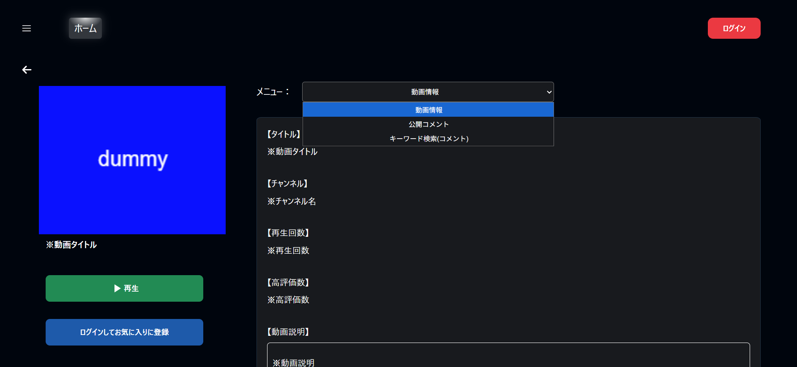
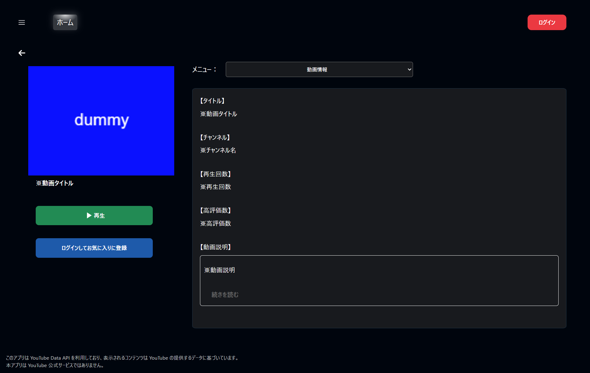
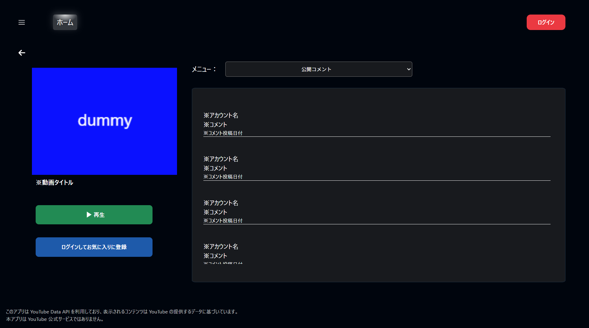
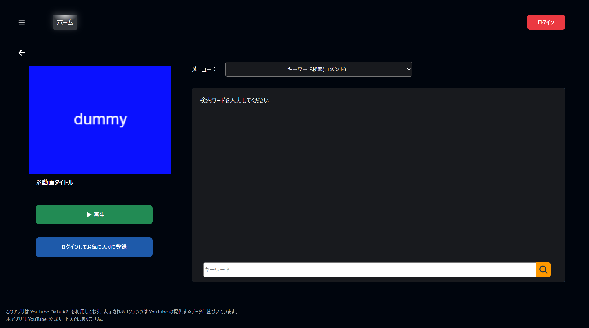
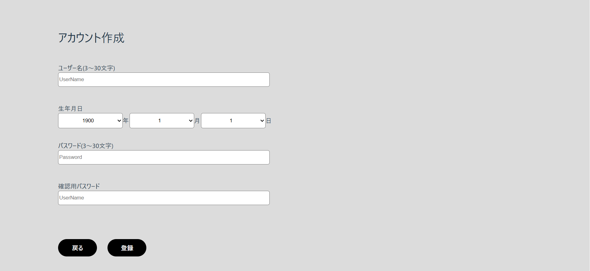
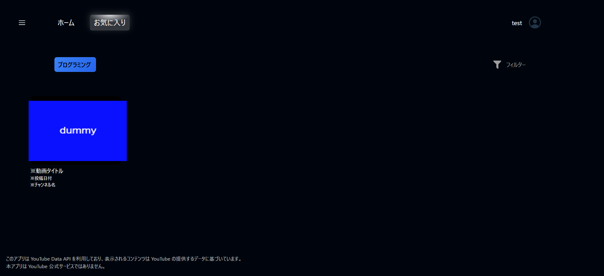
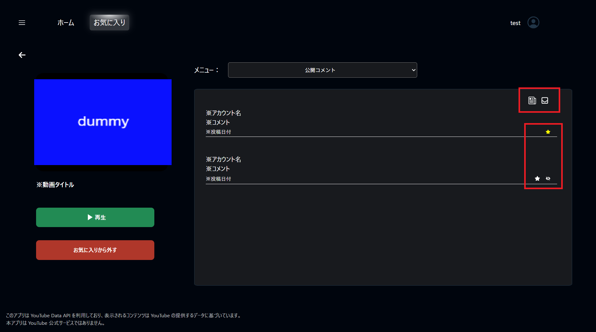
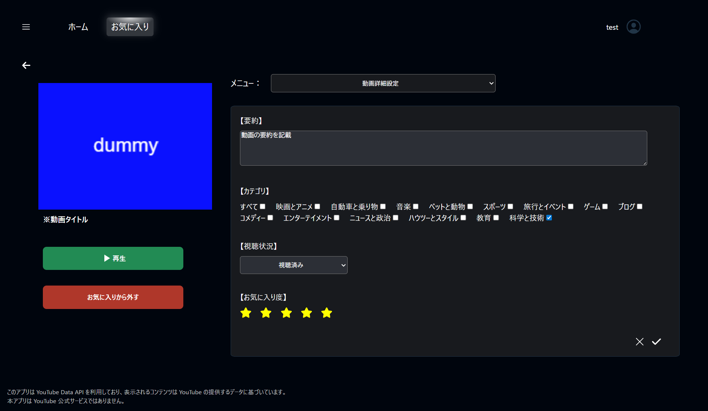
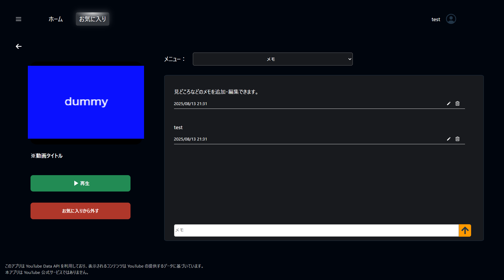
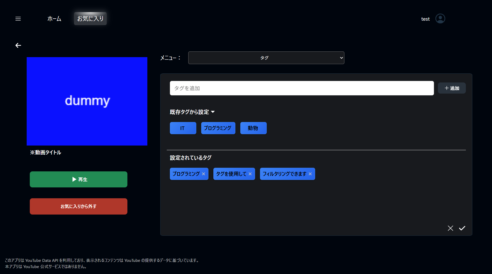

# 動画管理アプリ（フロントエンド）

## サービス概要
YouTube動画のお気に入り管理に特化したアプリです。YouTube APIを活用し、自分が気に入った動画を登録・整理し、あとから振り返りやすくすることを目的としています。
お気に入り登録した動画には、視聴メモを残したり、コメントを精査・記録したり、タグやカテゴリで管理したりといった細かなカスタマイズが可能。自分だけのライブラリを作る感覚で、YouTube体験を再構築できます。

## 開発背景
YouTubeを日常的に利用する中で、「この動画、また見返したい」と思うことがよくありました。特に気に入った動画では、一部分だけ何度も見直したいというケースが多く、その都度検索して探すのが面倒でした。
また、コメント欄には動画の内容を理解するヒントやユーモアのあるもの、逆にノイズに感じるコメントもあります。そうした情報を自分なりに整理し、蓄積したいという思いが、このアプリ開発のきっかけでした。

## 使い方
1. ホーム画面でキーワードを入力し、動画を検索します。
1. 気になる動画を選択すると、詳細画面に遷移します。
1. 詳細画面から「お気に入り」に登録できます（ログインが必要）。
1. お気に入り登録後、「お気に入り」画面から設定の変更が可能です。

## 機能一覧
| トップページ |
| ---- |
|   |
| 登録済み動画の一覧を表示します。キーワードや種別での検索が可能です。  |

| 　検索結果 |
| ---- |
|    |
| キーワード・種別に一致した動画一覧を表示します。  |

| 動画詳細(未ログイン) |
| ---- |
|    |
| 動画の検索結果で気になる動画をクリックすると詳細画面に遷移します。ログイン時に動画のお気に入り登録が可能となっています。 また以下のメニューを選択できます。 ・動画情報：選択した動画の基本情報を表示します。 ・公開コメント：動画に投稿されたコメントを閲覧できます。 ・キーワード検索(コメント)：投稿されたコメント内をキーワードで検索できます。  |

| 動画詳細(ログイン済) |
| ---- |
|    |
| ログインすると動画をお気に入りに追加できるようになりす。   |

| 動画詳細（動画情報メニュー選択時） |
| ---- |
|    |
| 動画詳細画面のメニューから「動画情報」を選択すると、タイトルや説明文などの基本情報を確認できます。|

| 動画詳細（公開コメントメニュー選択時） |
| ---- |
|    |
| 動画詳細画面のメニューから「公開コメント」を選択すると、動画に投稿されたコメントを確認できます。 ※掲載しているコメントはサンプルです。実際のアプリでは本来のコメントが表示されます。|

| 動画詳細（キーワード検索(コメント)メニュー選択時） |
| ---- |
|    |
| 動画詳細画面のメニューから「キーワード検索（コメント）」を選ぶと、コメント内のキーワード検索を行えます。|

| サイドメニュー |
| ---- |
|    |
|画面左上のハンバーガーメニューをクリックすると、以下メニューを選択できます。 ・使い方を見る ・使用上の注意|

| ログイン |
| ---- |
|    |
| ユーザー名とパスワードによる認証画面です。  |

| アカウント作成 |
| ---- |
|    |
| アカウントの作成画面です。  |

| ユーザー情報更新 |
| ---- |
|    |
| ユーザー情報の更新画面です。  |

| パスワード変更 |
| ---- |
|    |
| パスワードの変更画面です。  |

| お気に入り動画一覧 |
| ---- |
|    |
|   タグによるフィルタリング結果 ※タグの設定については「お気に入り動画詳細(タグ)」参照  |
| ログイン後、ヘッダーの「お気に入り」から、登録した動画一覧を確認できます。 一覧は以下の項目でソート可能です。 ・更新日 ・登録日 ・メモ登録数 ・お気に入りコメント登録数 ・お気に入り度 さらに、以下の条件でフィルタリングも行えます。 ・カテゴリ ・視聴状況 ・タグ ・お気に入り度   |

| お気に入り動画詳細 |
| ---- |
|    |
|お気に入り動画一覧で動画をクリックすると詳細画面に遷移します。 詳細画面では以下のメニューを選択できます ・動画情報：選択した動画の基本情報を表示します。 ・公開コメント：動画に投稿されたコメントを閲覧できます。 ・キーワード検索(コメント)：投稿されたコメント内をキーワードで検索できます。 ・動画詳細設定：視聴状況やお気に入り度などの設定を行います。 ・メモ：見どころなどのメモを追加・編集できます。 ・タグ：一覧画面でのフィルタリングに使用するタグを設定できます。   |

| お気に入り動画詳細（動画情報メニュー選択時） |
| ---- |
| ※動画詳細（動画情報メニュー選択時）参照|

| お気に入り動画詳細（公開コメントメニュー選択時） |
| ---- |
|    |
| お気に入り動画詳細画面のメニューから「公開コメント」を選択すると、動画に投稿されたコメントを確認できます。 コメント右端のアイコンから、各コメントに対して「お気に入り」または「非表示」を設定できます。 ※「お気に入り」に設定したコメントは、アイコンが強調表示されます。 また、セクション上部のアイコンから、「お気に入り」および「非表示」に設定したコメントをモーダルで参照することも可能です。 ※掲載しているコメントはサンプルです。実際のアプリでは本来のコメントが表示されます。|

| お気に入り動画詳細（キーワード検索(コメント)メニュー選択時） |
| ---- |
| ※動画詳細（キーワード検索(コメント)メニュー選択時）参照|

| お気に入り動画詳細(動画詳細設定) |
| ---- |
|    |
| お気に入り動画詳細画面のメニューから「動画詳細設定」を選択すると、動画に関する以下の情報を設定できます。 ・要約 ・カテゴリ ・視聴状況 ・お気に入り度|

| お気に入り動画詳細(メモ) |
| ---- |
|    |
| お気に入り動画詳細画面のメニューから「メモ」を選択すると、見どころや感想などのメモを追加・編集できます。|

| お気に入り動画詳細(タグ) |
| ---- |
|    |
| お気に入り動画詳細画面のメニューから「タグ」を選択すると、一覧画面での絞り込みに使うタグを設定できます。|

> **※掲載しているサムネイルはイメージです。アプリでは実際の動画情報が表示されます。**
>

## 使用技術
| カテゴリ          | 技術スタック  |
| ----------------- | --------------------------------------------------   |
| フロントエンド          | TypeScript, React|
| バックエンド           | TypeScript, Express, Prisma                           |
| インフラ    | Cloudflare, Render                          |
| データベース          | PostgreSQL                                           |

## 注意事項
- 本アプリは **YouTube Data API** を利用しており、表示されるコンテンツは YouTube が提供するデータに基づいています。  
- 本アプリは **YouTube公式サービスではありません**。
- 本アプリの内容を許可なく複製、配布、改変することを固く禁じます。